<<<<<<< HEAD:Lecture_1/homework1/Homework_20171621mindaein.md
# 3/19 수치해석 과제1 ---- 20171621 민대인
=======
# 3/19 수치해석 과제1 ---- 20171621민대인
>>>>>>> 81c24add5e356181a7994c89384efa1c29777c6b:homework1/Homework_20171621mindaein.md

---

## 1 머신러닝의 준비

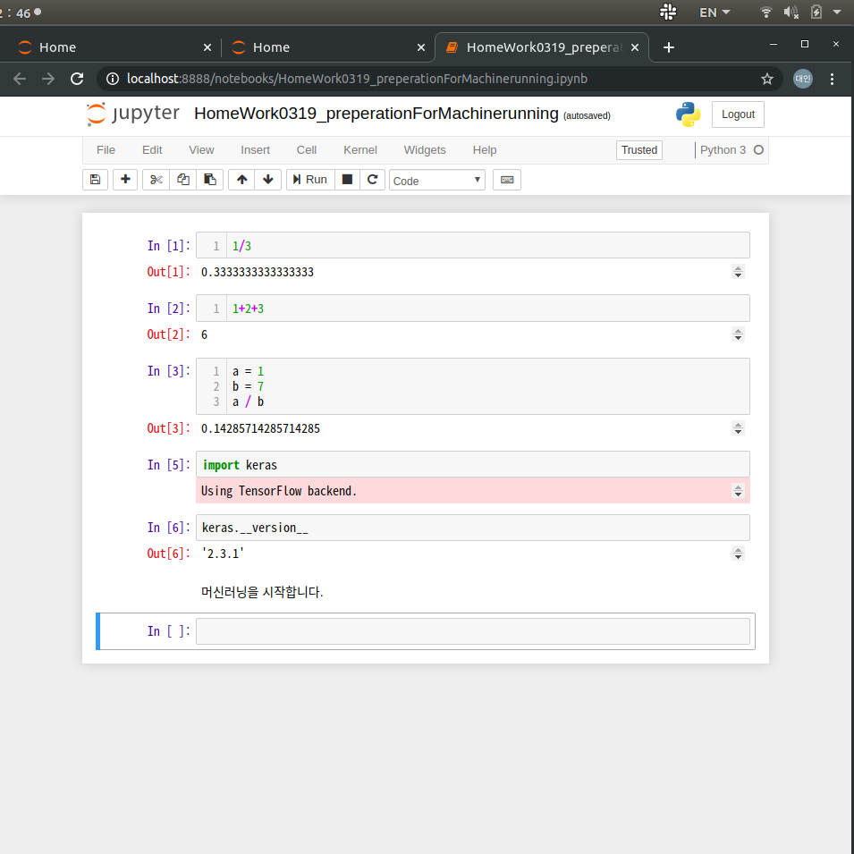

## 2.1 사칙연산

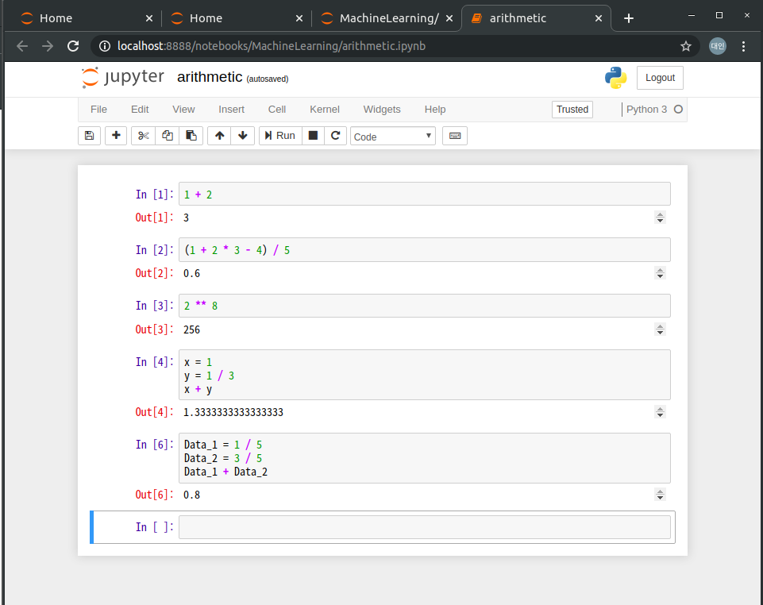

## 2.3 변수

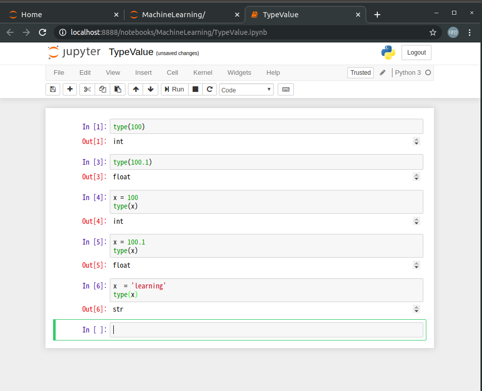

## 2.4 변수

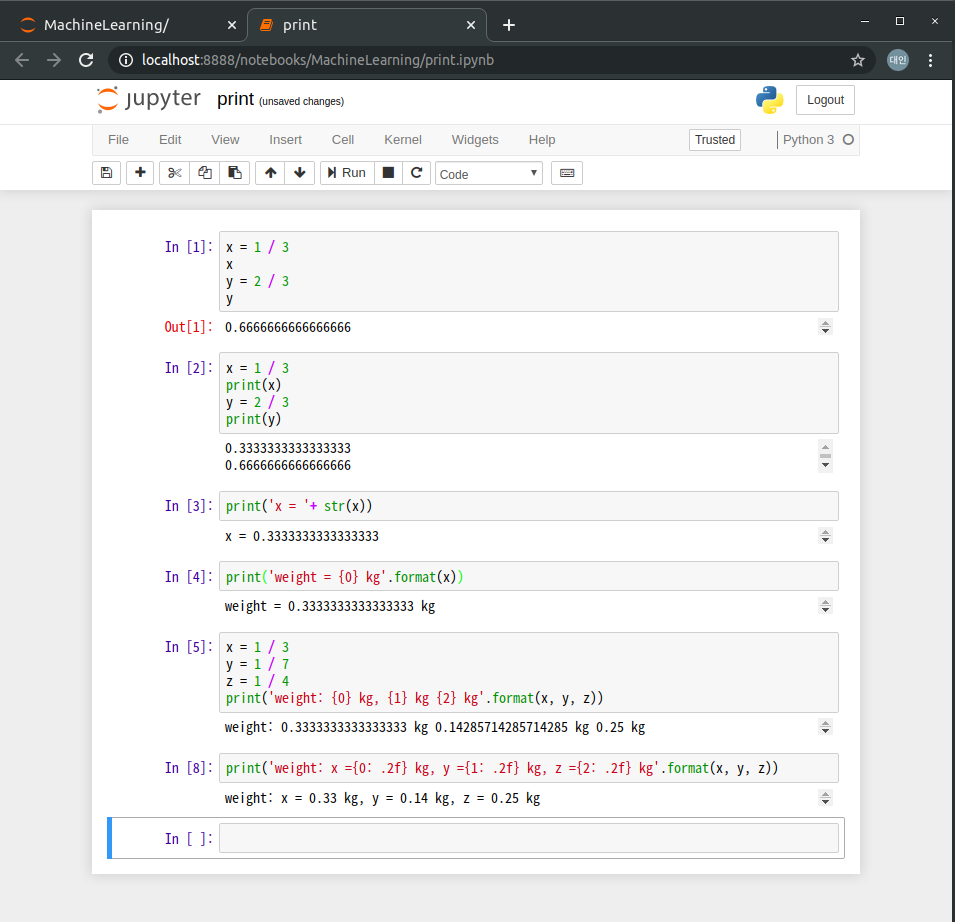

## 2.5 리스트

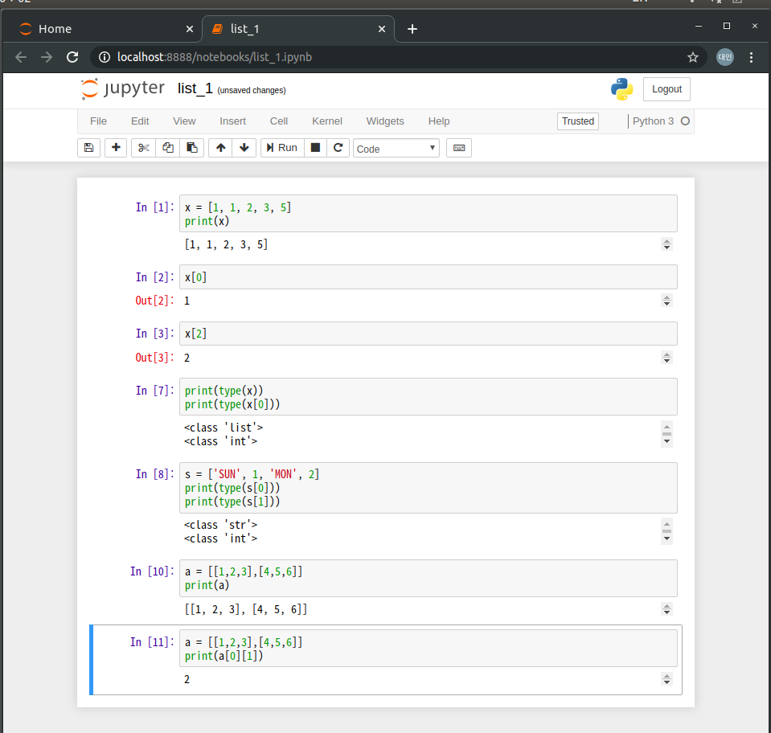

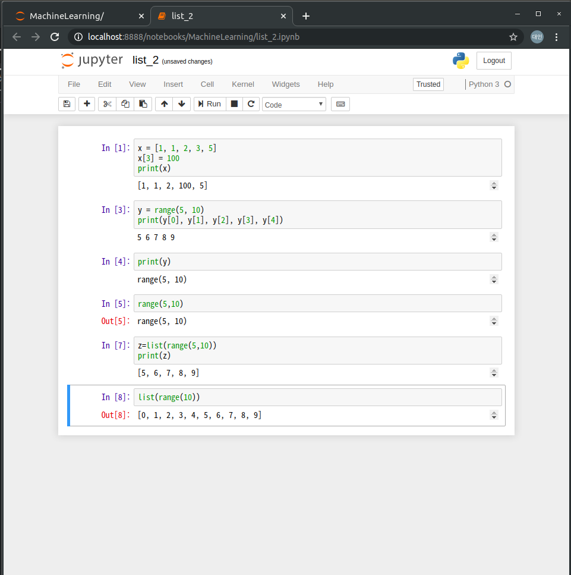

## 2.6 튜플

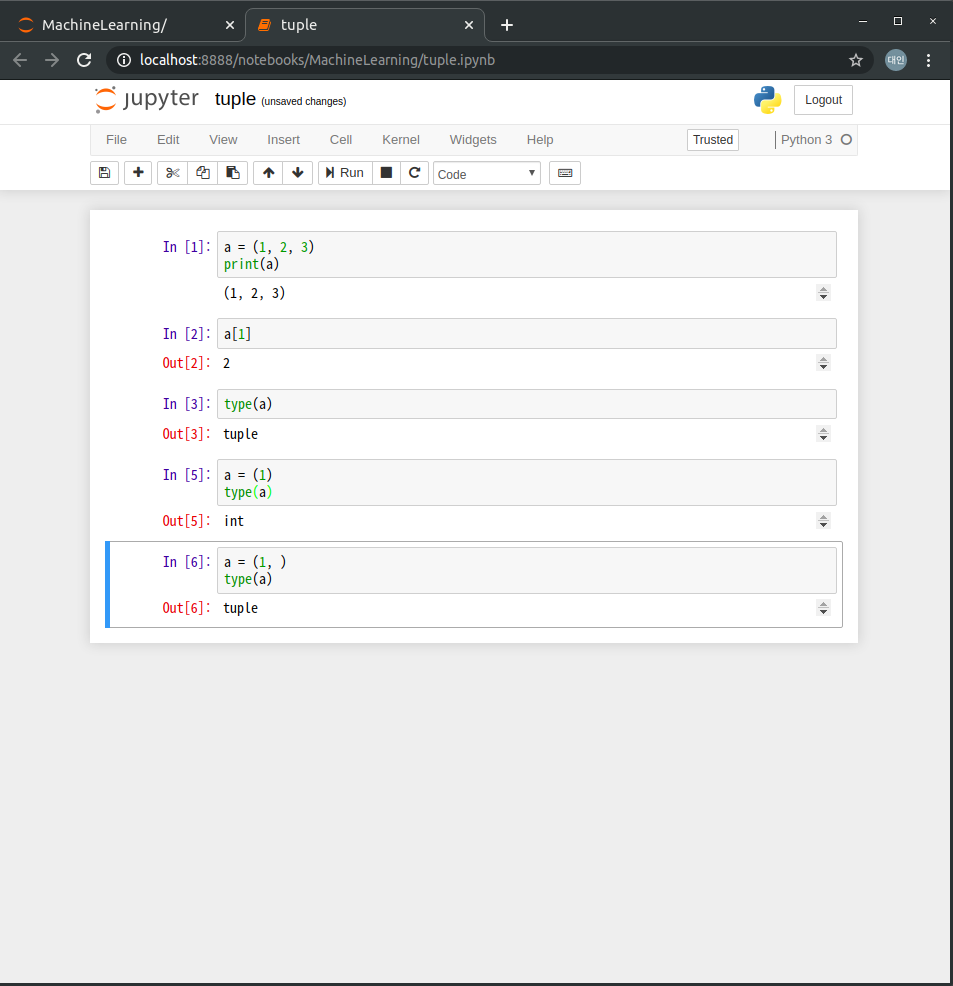

## 2.7 if 문

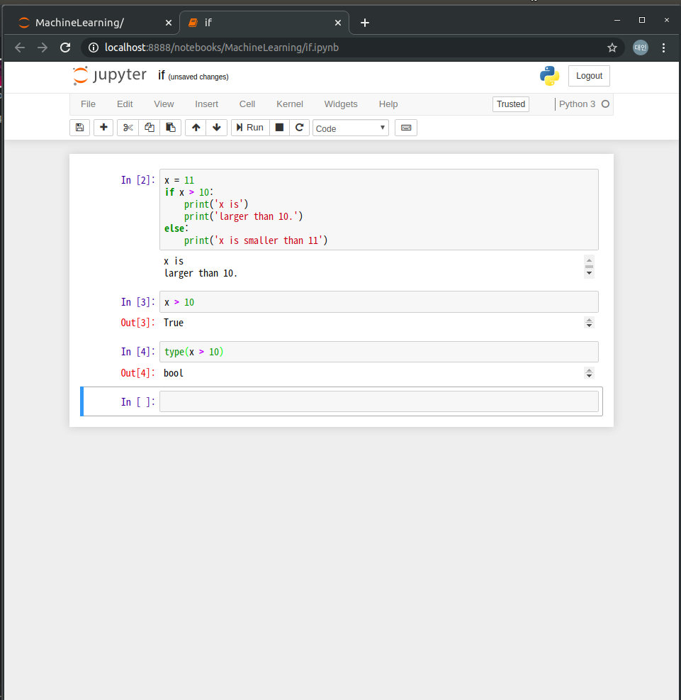
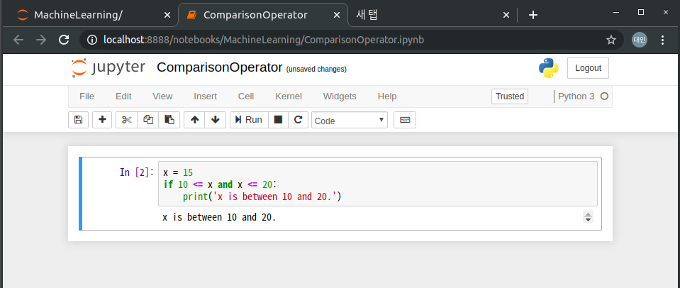

## 2.8 for 문

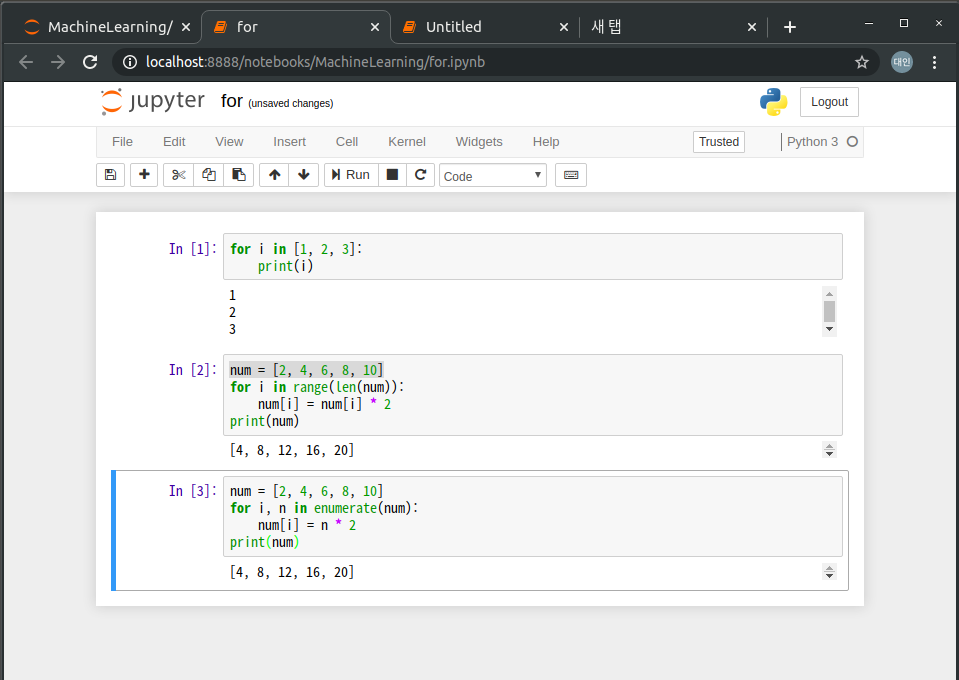

## 2.9 벡터

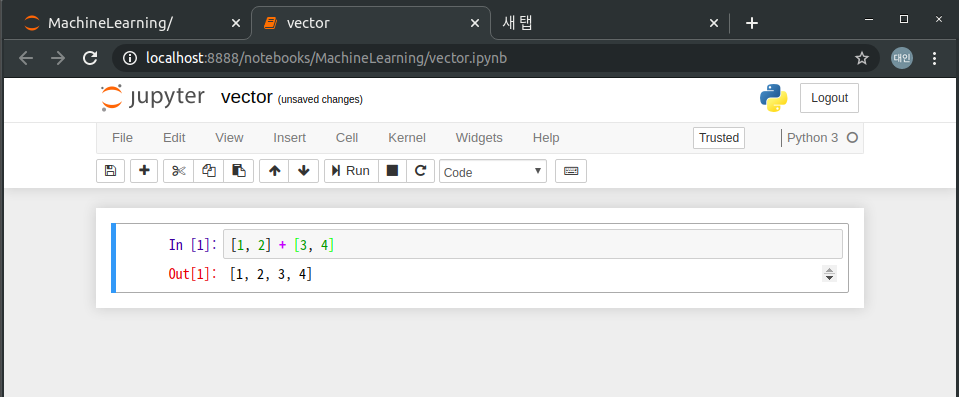
